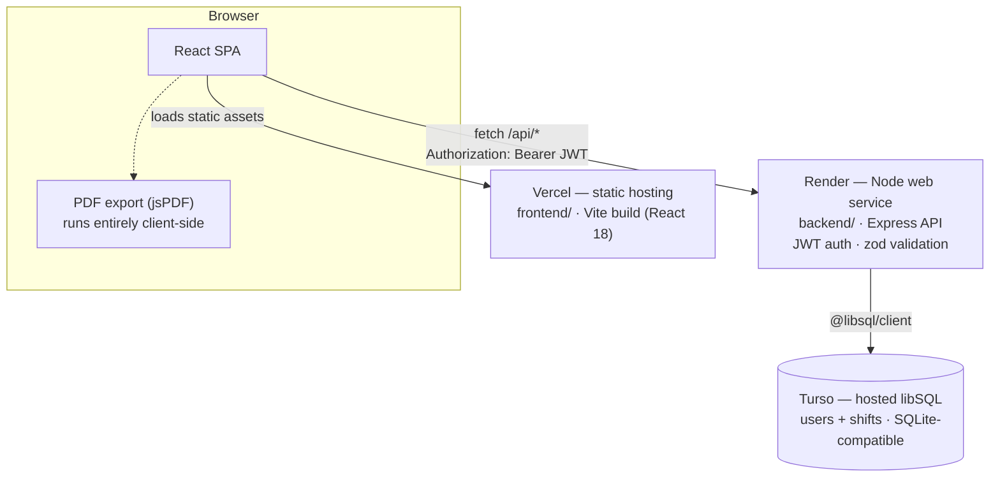

# Wage Tracker

A full-stack app for tracking work shifts, hourly earnings, and weekly goals — clock in/out and watch this week's earnings climb live, log shifts per day, see weekly/monthly/yearly earnings trends, and export a PDF report. Mobile-first, with a persistent sidebar dashboard layout on tablet/desktop.

**Live:**
- App: https://wages-tracker-frontend.vercel.app
- API: https://wage-tracker-api.onrender.com (health check: `/api/health`)
- Admin panel: https://wages-tracker-frontend.vercel.app/admin (password-gated — see [Admin panel](#admin-panel))

Backend is hosted on **Render**, frontend on **Vercel**, database on **Turso**. That's the actual deployment — see [Deploying](#deploying) below.

## Architecture

Three hosted pieces, talking over plain HTTPS — no shared filesystem, no server-to-server trust beyond a bearer token:



**Request flow:** the browser loads the compiled React app as static files from Vercel; from then on it talks directly to the Render API for everything else (`lib/api.ts` is the one place all of those `fetch` calls go through). Auth is a 30-day JWT returned on login/signup and sent back as `Authorization: Bearer <token>` on every subsequent request; `requireAuth` middleware on the backend verifies it and attaches `userId` before any route handler runs. The API is the only thing that talks to the database — the browser never touches Turso directly.

**Frontend structure:** no router, no external state library. `AppContext` (React context) is the single source of truth for the logged-in user, session token, and loaded shifts; `App.tsx` switches between screens (`Home`, `Entry`, `Report`, `History`, `Settings`) with local component state rather than URL-based routing. PDF reports are generated entirely in the browser with `jsPDF` — the backend is never involved in that step.

**Backend structure:** route groups (`routes/auth.ts`, `routes/me.ts`, `routes/shifts.ts`, `routes/dayExpenses.ts`, `routes/admin.ts`) sit behind Express, all async and going through `@libsql/client`. `day_expenses` holds one optional row per calendar day for fuel cost / other earnings — flat amounts added on top of hours × rate, not tied to any individual shift. `db.ts` is the only place that knows whether it's talking to a local SQLite file (dev) or a hosted Turso database (production, when `TURSO_DATABASE_URL` is set) — everything above it is unaware of the difference. Admin routes sit behind a separate `requireAdmin` middleware and token type from regular user auth, not layered on top of it — see [Admin panel](#admin-panel).

**Local dev** collapses the diagram above to two processes on one machine: Vite's dev server proxies `/api/*` to the Express server on `:4000`, and the backend falls back to a local SQLite file instead of Turso. See [Local development](#local-development).

## Tech stack

**Backend** (`backend/`)
- [Express](https://expressjs.com/) 4 + TypeScript, running on Node ≥20 (`type: module`, ESM throughout)
- [@libsql/client](https://github.com/tursodatabase/libsql-client-ts) — talks to a local SQLite file in dev, or a hosted [Turso](https://turso.tech) (libSQL) database in production, over the same client API
- Auth: [jsonwebtoken](https://github.com/auth0/node-jsonwebtoken) (30-day JWTs, invalidated early on password change via a `tokenVersion` claim). New passwords are hashed with Argon2id ([hash-wasm](https://github.com/Daninet/hash-wasm)); [bcryptjs](https://github.com/dcodeIO/bcrypt.js) is kept solely to verify (never create) hashes from before this migration, upgrading them to Argon2id on next login. Passwords are also subject to a length/blocklist policy — see [Authentication and password security](#authentication-and-password-security)
- [zod](https://zod.dev/) for request validation
- Hardening: [helmet](https://helmetjs.github.io/) (security headers), [express-rate-limit](https://github.com/express-rate-limit/express-rate-limit) (300 req/15min general, 20 req/15min on `/api/auth/*`), a CORS allowlist driven by `ALLOWED_ORIGINS`, and a startup check that refuses to boot in production without a real `JWT_SECRET`
- Dev tooling: [tsx](https://github.com/privatenumber/tsx) (watch mode), plain `tsc` for the production build
- Run with `node dist/index.js` after build; graceful shutdown on `SIGTERM`/`SIGINT`

**Frontend** (`frontend/`)
- React 18 + TypeScript, built with [Vite](https://vitejs.dev/) 8
- No router or state library — a single `AppContext` (React context + hooks) holds auth/session state and shift data; screens are switched by local state in `App.tsx`
- [jspdf](https://github.com/parallax/jsPDF) (+ `html2canvas`, pulled in transitively) to export weekly reports as PDF, including a 12-hour-clock shift table and a clickable credit footer
- Plain CSS (`styles/tokens.css`, `styles/app.css`, `styles/animations.css`, `styles/shell.css`, `styles/landing.css`) — no CSS framework, no animation library. The motion system (screen transitions, staggered card entrances, count-up numbers, chart/progress-bar animations) is hand-rolled CSS plus a small `useCountUp` hook, and is fully disabled under `prefers-reduced-motion`. `shell.css` turns the same bottom-tab-nav component into a persistent sidebar at tablet/desktop widths via CSS Grid — no separate desktop component, no router
- While a shift is active, this week's hours/earnings tick upward in real time (`useLiveElapsedHours`) on top of what's already saved, instead of only updating once you sign out
- API calls go through a small `fetch` wrapper (`lib/api.ts`) that targets `VITE_API_URL` in production or the Vite dev proxy locally, and centralizes auth-error handling (expired/invalid token → auto logout)
- `src/admin/` — a self-contained admin panel (own login, own API client, own token) reached at `/admin`; see [Admin panel](#admin-panel)
- Every build is stamped with the `package.json` version plus the exact git commit hash and commit date it was built from (`vite.config.ts` computes these at build time; see `lib/appVersion.ts`) — shown in Settings and in the PDF footer, so it's always possible to confirm which build is actually live without digging through deployed JS

**Data**: SQLite (via libSQL/Turso in production, a local file in dev) — no separate database server to run. Schema/migrations live in `backend/src/db.ts`. Shifts older than 5 years are pruned automatically by a daily job; a user can permanently delete their own account and every shift from Settings, or an admin can do the same for any account from the [admin panel](#admin-panel).

**Hosting**: Render (backend, Node web service) + Vercel (frontend, static Vite build) + Turso (database).

**Repo layout**: npm workspaces monorepo (`backend`, `frontend` as separate workspaces sharing one `package.json`/lockfile at the root). `frontend/src/admin/` is a self-contained module for the admin panel — its own login screen, API client, and stylesheet, isolated from the rest of the frontend.

`project/` holds the original Claude Design handoff files (HTML/CSS prototypes) — reference material only, not part of the running app. The original design conversation transcript lives locally in a `chats/` folder that's intentionally untracked (see `.gitignore`) — it never gets pushed to GitHub.

## Versioning

`frontend/package.json`'s `version` is bumped by hand on every commit that changes app behavior or code — patch (`1.1.0` → `1.1.1`) for fixes and small changes, minor (`1.1.0` → `1.2.0`) for a new feature, major for breaking changes. Pure docs/config-only commits (like a README tweak) don't bump it, since nothing about the running app changed. This is a project convention, not an automated tool — there's no npm publish step here, so a full [Conventional Commits](https://www.conventionalcommits.org/) + semantic-release setup would be more infrastructure than the project needs.

What *does* update automatically, on every single build with no exceptions, is the git commit hash and commit date the build was produced from (computed in `vite.config.ts`, exposed via `frontend/src/lib/appVersion.ts`). That's the part that actually proves which exact code is live — shown together with the version number in Settings and the PDF footer, e.g. `v1.1.0 (ba15955) · Aug 6, 2026`.

## Local development

From the repo root:

```bash
npm install
cp backend/.env.example backend/.env
npm run dev
```

This starts the backend on `http://localhost:4000` and the frontend on `http://localhost:5173` together. Open the frontend URL — in dev, Vite proxies `/api` requests to the backend (see `frontend/vite.config.ts`), so no extra config is needed.

Useful scripts (run from the root):

- `npm run dev` — backend + frontend, both in watch mode
- `npm run build` — production build of both
- `npm run typecheck` — type-check both
- `npm test` — run the full automated test suite (backend + frontend)

To try the admin panel locally, add `ADMIN_PASSWORD=something` to `backend/.env` and visit `http://localhost:5173/admin`.

## Testing and CI

The project has 124 automated tests: 87 backend integration/API tests (`backend/test/`), written with [Vitest](https://vitest.dev/) and [Supertest](https://github.com/ladjs/supertest) and exercising the real Express app end-to-end over HTTP, each test file getting its own isolated, throwaway temporary SQLite database (see `backend/test/testApp.ts`) so runs never share or pollute data; plus 37 frontend tests (`frontend/src/lib/__tests__/`), also Vitest, covering wage/duration calculations, week aggregation, PDF report data, and password-policy validation. Of the 87 backend tests, 30 specifically cover authentication and password security — `passwordPolicy.test.ts`, `change-password.test.ts`, `passwordHashing.test.ts`, and `passwordMigration.test.ts` — described in [Authentication and password security](#authentication-and-password-security) below.

Run everything with `npm test` from the root, or target one workspace at a time with `npm run test -w backend` / `npm run test -w frontend`.

[GitHub Actions](.github/workflows/ci.yml) runs on every push and pull request to `main`: type-checking, the test suite, and a production build, for both the backend and frontend workspaces as separate parallel jobs.

## Configuration

### Backend (`backend/.env`, copy from `backend/.env.example`)

| Variable | Required | Notes |
| --- | --- | --- |
| `PORT` | no | defaults to `4000` |
| `NODE_ENV` | recommended | set to `production` in production — enables the JWT secret check |
| `JWT_SECRET` | **yes, in production** | the app refuses to start in production with the default/dev secret. Generate one with `node -e "console.log(require('crypto').randomBytes(48).toString('hex'))"` |
| `DB_PATH` | no | path to a local SQLite file, defaults to `./data/wage-tracker.sqlite`. Only used when `TURSO_DATABASE_URL` is unset — fine for local dev, but most PaaS filesystems are ephemeral, so don't rely on this in production |
| `TURSO_DATABASE_URL` | **yes, in production** | hosted libSQL/Turso database URL, e.g. `libsql://your-db-your-org.turso.io`. When set, this replaces the local SQLite file so data survives restarts/redeploys. Leave unset locally |
| `TURSO_AUTH_TOKEN` | **yes, in production** (if `TURSO_DATABASE_URL` is set) | auth token for the database above, from `turso db tokens create <db-name>` |
| `ALLOWED_ORIGINS` | **yes, in production** | comma-separated list of browser origins allowed to call the API, e.g. `https://your-app.vercel.app` |
| `ADMIN_PASSWORD` | no, but the admin panel is disabled without it | a single shared secret (unrelated to any user account) gating the admin panel at `<frontend-url>/admin`. See [Admin panel](#admin-panel) |
| `ARGON2_MEMORY_COST_KIB` | no | Argon2id memory cost in KiB for new password hashes, defaults to `19456` (19 MiB) — the OWASP-recommended minimum. See [Authentication and password security](#authentication-and-password-security) |
| `ARGON2_TIME_COST` | no | Argon2id iteration count, defaults to `2` |
| `ARGON2_PARALLELISM` | no | Argon2id parallelism factor, defaults to `1` |

### Frontend (`frontend/.env`, copy from `frontend/.env.example`)

| Variable | Required | Notes |
| --- | --- | --- |
| `VITE_API_URL` | **yes, in production** | the deployed backend's origin, e.g. `https://wage-tracker-api.onrender.com`. Leave unset locally — the Vite dev proxy handles it |

## Authentication and password security

Regular-user authentication (separate from the admin panel below, which has its own isolated auth — see [Admin panel](#admin-panel)):

- **Password policy** — enforced server-side in `backend/src/security/passwordPolicy.ts` (the single source of truth; a frontend copy in `frontend/src/lib/passwordPolicy.ts` gives inline feedback on the signup form and in Settings as you type, and is never trusted on its own — the backend re-validates independently). New and changed passwords must be 15–128 Unicode code points, with no forced composition rules — uppercase, numbers, and symbols are all optional, and spaces and full Unicode are allowed. Passwords are never trimmed or otherwise modified before hashing, since leading/trailing spaces are legal characters. Candidates are checked against a maintainable blocklist (`backend/src/security/commonPasswords.ts`) two different ways: general common/weak passwords (e.g. "welcometothejungle") are rejected only on an exact, NFC-normalized match against the *whole* password — not a substring match, so a genuine passphrase that happens to contain an ordinary word (e.g. "...dark chocolate chip cookies...") is never falsely rejected — while obvious app-specific values like "wagetracker" are still caught as a substring anywhere in the password, in any decorated form. This policy applies only when a password is *set* — signup and the change-password endpoint below — never to login, so accounts created before this policy existed keep working with their original, shorter password.
- **Password hashing: Argon2id, with legacy bcrypt still supported for verification** — new passwords (every signup and every password change) are hashed with Argon2id, the current OWASP-recommended default, using `hash-wasm` (`backend/src/security/passwordHashing.ts`) — a pure WebAssembly implementation with no native/compiled bindings, chosen for the same portability reason this project uses `bcryptjs` instead of native `bcrypt`. Parameters follow OWASP's minimum guidance (19 MiB memory, 2 iterations, parallelism 1) and are configurable via `ARGON2_MEMORY_COST_KIB`/`ARGON2_TIME_COST`/`ARGON2_PARALLELISM`. Accounts created before this migration still have a bcrypt hash (`$2a$`/`$2b$`/`$2y$`) — `verifyPassword` detects which format a stored hash is and checks it correctly either way (bcrypt's own `compare` is still used for those, asynchronously rather than the blocking `compareSync`, so a slow check doesn't hold up the rest of an already-busy event loop as long — though under real concurrent load it can still contend with other async work, so this isn't a guarantee of zero impact). A successful login against a legacy bcrypt hash transparently rehashes the password with Argon2id and overwrites the stored hash, so the user base migrates itself through normal use rather than needing a bulk migration or forced reset. Account deletion's password confirmation goes through the same dual-format `verifyPassword`, so it works unchanged for either kind of account.
- **Changing your password** — `PATCH /api/me/password` (authenticated, in Settings under "Change password") takes `currentPassword` and `newPassword`, verifies the current password (against whichever hash format it's currently stored as), validates the new one against the policy above, rejects reusing the current password, and always stores the new hash as Argon2id regardless of the account's previous format. Responds `204 No Content`.
- **Session invalidation on password change** — every user row has a `token_version` column, and every regular-user JWT carries a matching `tokenVersion` claim checked on each request. Changing your password increments the column, which instantly invalidates every JWT issued before the change — including on other devices — without waiting for their natural 30-day expiry. The device that made the change isn't logged out: the change-password response includes a replacement token in an `X-New-Token` response header (not the JSON body, since the endpoint itself returns 204), which the frontend stores and keeps using automatically. This mechanism is specific to regular-user tokens; admin tokens are untouched.

This covers password strength, hashing, and session invalidation on password change — it does not include multi-factor authentication, cookie-based sessions, email verification, or password recovery, none of which exist in the app yet.

## Admin panel

A separate, standalone view at `/admin` (e.g. `https://wages-tracker-frontend.vercel.app/admin`) for seeing everything stored in the database and deleting a user if needed — password-hidden info like `password_hash` is never sent to it, but every other field is.

It's built to be fully isolated from regular user accounts, not a "role" on top of one:

- Gated by a single shared `ADMIN_PASSWORD` (backend env var) — not tied to any user's email/password.
- Its session token is a distinct JWT carrying a `role: "admin"` claim, expires in 12 hours (vs. 30 days for regular users), and is checked by its own `requireAdmin` middleware — a regular user's token is rejected with a 403 even if someone tried to reuse it here.
- The frontend stores the admin token under its own `localStorage` key and never shares state with the regular `AppContext`/user session — logging into `/admin` doesn't log you into the app and vice versa.
- Not linked from anywhere in the regular app UI; reaching it means knowing the URL and the password.
- Its login endpoint (`POST /api/admin/login`) has its own tight rate limit (10 attempts/15min) separate from the general API limiter, since a shared admin password is a higher-value brute-force target than any one user's password.

What it shows: every user (name, email, work info, rate, goals, join date, shift count), a searchable table, and a "View" drill-down per user with their full shift history. Deleting a user requires typing their email into the confirmation dialog first — deletion is immediate and permanent (same explicit shift-then-user delete as the self-service "Delete account" flow in Settings, not a soft delete).

**Setup:** set `ADMIN_PASSWORD` in `backend/.env` (local) or on the Render service (production) — see the Backend config table above. Leave it unset to disable the panel entirely (the login endpoint always returns 401 without it).

## Deploying

This is what's actually running in production: **backend on Render, frontend on Vercel, database on Turso.**

### Database — Turso

The backend needs a hosted database before it can hold durable data (see the storage caveat under Render below for why). [Turso](https://turso.tech) is a hosted libSQL — i.e. SQLite-compatible — database with a free tier; the schema in `backend/src/db.ts` is plain SQLite, so nothing about it needs to change to use it.

1. Install the CLI and sign up: `curl -sSfL https://get.tur.so/install.sh | bash`, then `turso auth signup` (or `turso auth login` if you already have an account).
2. Create a database: `turso db create wage-tracker`.
3. Get the connection URL: `turso db show wage-tracker --url` → this is `TURSO_DATABASE_URL`.
4. Create a token: `turso db tokens create wage-tracker` → this is `TURSO_AUTH_TOKEN`.
5. Set both as environment variables on the Render service (below).

Local dev doesn't need any of this — with `TURSO_DATABASE_URL` unset, the backend falls back to a local SQLite file (`DB_PATH`) automatically.

### Backend — Render

`render.yaml` at the repo root is a ready-to-use Render Blueprint: New → Blueprint in the Render dashboard, point it at this repo, it auto-detects `render.yaml`. It builds the backend workspace, runs it with `npm run start -w backend`, and wires up a health check at `/api/health`.

Two things it's already configured to handle:
- **Build command** is `npm install --include=dev && npm run build -w backend` — the `--include=dev` is required because Render sets `NODE_ENV=production` before installing, which npm otherwise treats as "skip devDependencies," and `typescript`/`@types/*` (needed to compile) live there. Without this, the build fails with a wall of "cannot find declaration file" errors.
- **`ALLOWED_ORIGINS`** is left blank in the blueprint (marked `sync: false`) since you won't have a frontend URL yet on first deploy — Render will prompt you for a value when you deploy the blueprint. Put in a harmless placeholder (e.g. `http://localhost:5173`), then come back and set it to the real Vercel URL once the frontend is deployed (Environment tab on the service → edit `ALLOWED_ORIGINS` → save, which triggers an automatic redeploy).

Set `TURSO_DATABASE_URL` and `TURSO_AUTH_TOKEN` on the service (Environment tab) using the values from the Turso setup above. Render's free plan has no persistent disk, but that no longer matters here — the database lives on Turso, not on this service's local filesystem, so restarts/redeploys/spin-downs don't touch your data.

### Frontend — Vercel

Import this repo into Vercel. In the import settings, set **Root Directory** to `frontend` — this is important, it's a monorepo, and without it Vercel will try to auto-detect the `backend` Express app as a *second* deployable "service" in the same project. Don't deploy that: Vercel runs it as serverless functions, which breaks the SQLite file (no persistent disk, no shared filesystem between invocations) and the graceful-shutdown/`server.listen()` code in `backend/src/index.ts`. The backend only runs correctly on Render.

Once Root Directory is set to `frontend`, `frontend/vercel.json` supplies the build command and output directory automatically. Add one environment variable before deploying: `VITE_API_URL` = your Render backend URL (e.g. `https://wage-tracker-api.onrender.com`).

### Order of operations

1. Create the Turso database and grab its URL + token (see above).
2. Deploy the backend to Render, with `TURSO_DATABASE_URL`/`TURSO_AUTH_TOKEN` set and `ALLOWED_ORIGINS` set to a placeholder.
3. Deploy the frontend to Vercel, with `VITE_API_URL` set to the Render URL from step 2.
4. Go back to Render and set `ALLOWED_ORIGINS` to the real Vercel URL from step 3, then save (auto-redeploys).

### Other hosts (not currently used)

The repo also has `railway.json` (Railway, as a backend alternative to Render) and `frontend/netlify.toml` (Netlify, as a frontend alternative to Vercel), in case you ever want to switch. They aren't part of the live deployment and nothing above depends on them — safe to ignore, or delete if they're just noise.

## Production checklist

- [x] `JWT_SECRET` set to a strong, unique value (not the dev default) — auto-generated by the Render blueprint
- [x] `NODE_ENV=production` set on the backend
- [x] `ALLOWED_ORIGINS` set to the real frontend URL
- [x] `TURSO_DATABASE_URL` / `TURSO_AUTH_TOKEN` set on the backend — data lives on Turso, independent of Render's ephemeral filesystem
- [x] `VITE_API_URL` set on the frontend build to the backend's URL
- [x] Backend `/api/health` returns `{"ok": true}`
- [x] Rate limiting is on by default (300 req/15min general, 20 req/15min on `/api/auth/*`, 10 req/15min on `/api/admin/login`) — adjust in `backend/src/index.ts`/`backend/src/routes/admin.ts` if it's too strict/loose for your traffic
- [ ] `ADMIN_PASSWORD` set on the backend — optional; the admin panel (`/admin`) stays disabled (login always 401s) without it
