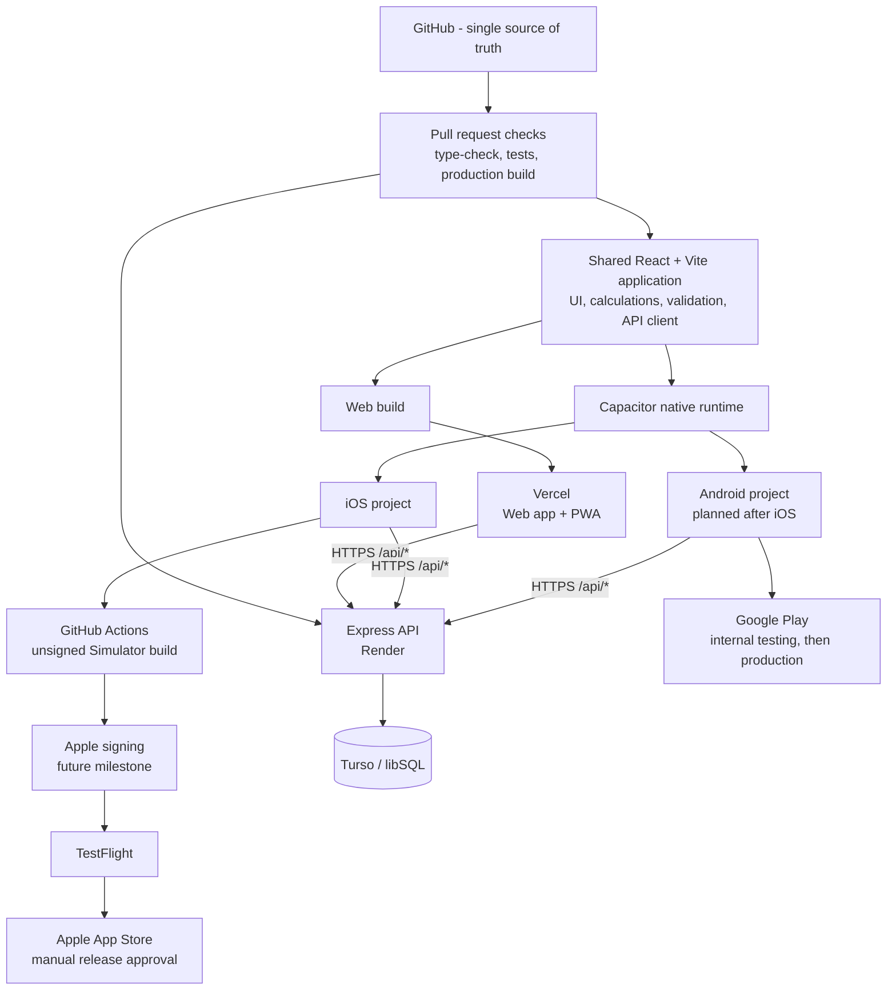
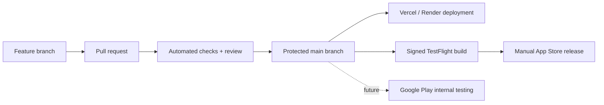
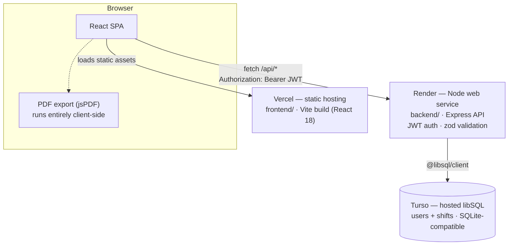

# Wage Tracker

A full-stack app for tracking work shifts, hourly earnings, and weekly goals — clock in/out and watch this week's earnings climb live, log shifts per day, see weekly/monthly/yearly earnings trends, and export a PDF report. Mobile-first, with a persistent sidebar dashboard layout on tablet/desktop.

**Live:**
- App: https://wages-tracker-frontend.vercel.app
- API: https://wage-tracker-api.onrender.com (health check: `/api/health`)
- Admin panel: https://wages-tracker-frontend.vercel.app/admin (password-gated — see [Admin panel](#admin-panel))

Backend is hosted on **Render**, frontend on **Vercel**, database on **Turso**. That's the actual deployment — see [Deploying](#deploying) below.

## Features

### Responsive Settings hub

- Categorized navigation — Profile & preferences, Work & pay, Weekly goals, Security, and Data & account — each row showing an icon, label, and short description, with a clear accent-tinted active state
- Mobile list/detail navigation that collapses to a single column below the app's `1080px` breakpoint, and a persistent two-column layout above it
- Category switching animates only background, border, and text/icon color — never a scale or position change — so nothing shakes or jumps when a row is pressed or selected
- Every category panel stays mounted while you navigate between them, so an unsaved edit in one category is still there if you switch away and back
- Fully keyboard-operable, with a focus ring that's visually distinct from the selected-row styling, and touch targets sized for mobile use

### API/server wake-up experience

- A dedicated loading screen shown when the hosted API is waking up from an idle Render instance, or during a slower-than-usual login/signup request
- Backed by real health checks against `/api/health` — connecting, waking, slow, connected, offline, and failed states are each a distinct, clearly worded message, not a guess
- Shows the actual connection-attempt number and real elapsed waiting time
- A Retry action appears for the offline, timeout, and connection-failure states
- Only one health check is ever in flight at a time; it's cancelled automatically on unmount, on retry, or once a 120-second max wait is reached
- The ring completes and shows 100% only after a genuinely successful health response — never as an estimate

A `/api/health` response only ever tells the browser one of two things: it hasn't answered yet, or it just answered successfully. There's no way to know how close a cold-starting server actually is to being ready, so the loading indicator is intentionally an indeterminate spinning ring rather than a progress bar — the app never shows a manufactured completion percentage while waiting.

## Accessibility

- **Live status announcements** — the wake-up screen's status text sits in `role="status" aria-live="polite"`, so screen readers announce real phase changes (e.g. "Connecting…" → "Waking the server…" → "Connected") without re-announcing the ticking elapsed-time counter every second — that part is `aria-hidden`, since it's cosmetic, not a new fact
- **Keyboard-operable controls** — every Settings category row and the wake-up screen's Retry button are real `<button>` elements, fully reachable and operable by keyboard, with a focus ring that's visually distinct from the selected-row's accent styling
- **Focus moves to Retry automatically** — entering the offline or failed state moves focus straight to the Retry button, so keyboard and screen-reader users don't have to search for it
- **Minimum 44px touch targets** — both Settings rows and the Retry button meet the 44px minimum, checked at mobile widths
- **Stable button widths during label changes** — the Retry button's "Retry"/"Retrying…" swap (and other loading-label swaps elsewhere in the app) render through `StableLabel`, which reserves layout space for the longer of the two strings so nearby content never shifts when the label changes
- **`prefers-reduced-motion` support** — the connection ring's spin and the rest of the app's animation system (see [Tech stack](#tech-stack)) collapse under `prefers-reduced-motion: reduce`; the wake-up screen also checks the same preference directly and swaps in a static ring
- **No misleading `aria-valuenow`** — the connection ring carries no ARIA progress role or value while indeterminate, since there's no real percentage to expose
- **Responsive at every width** — Settings and the wake-up screen were verified at mobile (390px), tablet (768px), and desktop (1080px+) widths, including at 200% browser zoom, without text clipping or layout breakage
- **Charts have textual equivalents** — Home's week-at-a-glance bars and the Report screen's line chart and period bars are each either named (`role="img"` plus a summary describing the shape and range) or hidden from assistive tech, and the same figures are published once as a real table with a caption and header cells (`ChartDataTable`). Earnings tables mask their values while the privacy toggle is on, and the masked figures are not left in the DOM in plain text
- **One landmark per region** — `<header>`, `<nav>`, and `<main>` in the authenticated shell; `<main>` on the auth and wake-up screens. Landmark navigation reaches every part of the app, including the log-out and earnings-privacy controls
- **One `<h1>` per screen, no skipped levels** — enforced by a test rather than by review. On a phone the Settings page head sits outside both panels and is clipped rather than `display: none`, because hiding a panel would otherwise take the page's only `<h1>` out of the accessibility tree along with it
- **One status-message component** — `StatusBanner` renders every success, warning, danger and informational message in the app. Icon plus text always, so no state is carried by colour alone; the live-region role follows the tone (danger interrupts with `role="alert"`, everything else is polite); dismissal is a real button with a 44×44 hit area, not a click handler on a `<div>`
- **Contrast is computed, not asserted** — `styles/__tests__/contrast.test.ts` reads the hex values straight out of `tokens.css` and checks every semantic pair against the WCAG AA 4.5:1 threshold for normal text, so a palette retune that breaks one fails the build

## Historical week editing and PDF downloads

- **Every completed week in History has its own PDF download** and expands to its seven days, each with an `Edit hours` / `Add hours` action. The week's figures come from `buildWeeklyHistory` and `buildWeekDaysComputed` — the same functions Home, Entry and Report use — so History cannot disagree with the rest of the app about a week's total.
- **Sign-in and sign-out are the editable truth.** Hours are shown as a live read-only readout computed with `computeHours`, never typed. Letting a total be overwritten directly would create a second source for a number that is derived everywhere else.
- **Recalculation needs no cache invalidation.** Every screen derives from the one `shifts` array in `AppContext`, so a corrected day propagates to History, Home's prior-week comparison and the Report charts without a page reload. PDF downloads deliberately go one step further: immediately before generation, the shared Report/History pipeline refetches the selected week's authenticated shifts, fuel/day expenses and other earnings, then builds the client-side jsPDF from those fresh persisted results. This prevents an open page from exporting stale data after the same account was edited on another device.
- **One filename rule for every weekly PDF** — `{display name}-{week start}-to-{week end}.pdf`, e.g. `Ezaz Ahmad-2026-08-03-to-2026-08-09.pdf` (`lib/pdfFilename.ts`). ISO dates so a folder of them sorts chronologically; spaces and Unicode letters preserved; reserved characters, control characters (including the CRLF that would split a `Content-Disposition` header), path traversal, leading/trailing dots and Windows device names all neutralised; `User-` as the fallback when the profile name is empty — never a user id.
- **Shift rules apply to every write, current-week and historical alike** (`backend/src/security/shiftRules.ts`, mirrored client-side in `lib/shiftRules.ts` for immediate feedback). Overlap prevention uses half-open intervals, so back-to-back shifts are neighbours rather than conflicts. Every distinct start/finish pair under 24 hours is valid, including overnight work; a duration over 16 hours is treated as unusual and gets a clear, non-blocking confirmation before Entry or History saves it. Cancelling leaves the shift unchanged, while confirming preserves the exact times. Zero-length shifts remain invalid.
- **Future dates use the device's real calendar, with the server authoritative.** The frontend rejects a date later than the browser's current local `YYYY-MM-DD` immediately. Every shift create/update also sends the current device IANA timezone in `X-Client-Time-Zone`; the backend validates it, converts its own current timestamp into that zone, and rejects any start date later than that local date. Today is accepted, tomorrow is not, and a shift starting today and ending after midnight remains valid. Missing/invalid headers get a friendly validation response rather than a silent UTC or Sydney fallback.
- **PDF failures show a generic message.** Generation is client-side, so every reachable failure is internal detail; the specific error goes to the console rather than onto the screen. The shift-editing path does the opposite and shows the server's message verbatim, because "that overlaps another shift you've already logged" is something the user can act on.

## Product status and roadmap

Wage Tracker is a production web application and installable PWA with a committed Capacitor iOS shell. The native shell compiles in cloud CI but is not yet signed, distributed through TestFlight, or available in the App Store. The mobile strategy deliberately keeps product logic in one tested React/TypeScript codebase and introduces thin platform adapters only where web and native behaviour genuinely differ.

| Capability | Current status | Planned delivery |
| --- | --- | --- |
| Responsive web application | Live on Vercel | Continues as the fastest release channel |
| Installable PWA | Available from supported browsers | Maintained alongside native applications |
| iPhone application | Capacitor shell and unsigned cloud build available | Signing, device testing, TestFlight, then App Store review |
| Android application | Planned after iOS | Same Capacitor foundation, internal testing, then Google Play |
| Shared backend | Live on Render with Turso | One versioned HTTPS API for web, iOS, and Android |

### Target multi-platform architecture



The shared application is not three independent implementations. A change to a screen, calculation, validation rule, or API contract is made once and reaches each client in its next release. Delivery cadence remains platform-specific: Vercel can deploy the web build automatically after a merge, while iOS and Android require signed builds, store testing, and store approval.

Only platform boundaries receive adapters. Authentication uses unchanged browser storage on the web. On iOS, an unchecked session remains in memory and ends when the native process restarts, while Remember Me stores the session in an encrypted, device-only Keychain entry. PDF creation remains shared and client-side: browsers retain the existing download adapter, while iOS writes the same bytes temporarily to Cache and presents Apple's share sheet. Connectivity and lifecycle signals also stay behind platform adapters; API responses remain authoritative. This keeps platform code small, auditable, and replaceable without forking core business logic.

### Delivery roadmap

1. **Store-readiness foundation - complete** - publish privacy/support pages, allow native API origins, introduce platform-neutral token/PDF boundaries, and verify authentication and account-deletion flows.
2. **iOS shell and cloud-build foundation - complete** - add the thin, iPhone-only Capacitor/Xcode project, Remember Me storage in Keychain, reproducible SPM dependencies, and an unsigned Simulator build on GitHub-hosted macOS.
3. **iOS product integration - complete** - add native PDF sharing, lifecycle/connectivity handling, final icons/splash assets, and the reviewed iOS privacy manifest.
4. **iOS delivery** - configure Apple signing, distribute internal builds through TestFlight, complete physical-device regression testing, and submit a manually approved release to the App Store.
5. **Android delivery** - add the Android project from the same Capacitor codebase, use Android Keystore-backed session storage, test through Google Play's internal track, and prepare a production release.
6. **Operational maturity** - add mobile crash reporting, privacy-preserving release telemetry, dependency and security scanning, documented rollback procedures, and versioned release notes.

### Release engineering model



Application changes should enter through a feature branch and pull request, with CI passing before merge. Web/API deployment and beta-build creation may be automated from the protected main branch; public mobile-store releases remain explicit, versioned decisions. Every TestFlight or App Store upload receives a unique build number, and release tags identify the source commit used to produce it.

## Architecture

### Current production architecture

Three hosted pieces, talking over plain HTTPS — no shared filesystem, no server-to-server trust beyond a bearer token:



**Request flow:** the browser loads the compiled React app as static files from Vercel; from then on it talks directly to the Render API for everything else (`lib/api.ts` is the one place all of those `fetch` calls go through). Auth is a 30-day JWT returned on login/signup and sent back as `Authorization: Bearer <token>` on every subsequent request; `requireAuth` middleware on the backend verifies it and attaches `userId` before any route handler runs. The API is the only thing that talks to the database — the browser never touches Turso directly.

**Frontend structure:** no router, no external state library. `AppContext` (React context) is the single source of truth for the logged-in user, session token, and loaded shifts; `App.tsx` switches between screens (`Home`, `Entry`, `Report`, `History`, `Settings`) with local component state rather than URL-based routing. PDF rendering and saving stay entirely in the browser with `jsPDF`; the shared download pipeline first retrieves the selected week's latest authenticated records through the existing data APIs, with no backend PDF endpoint.

Settings itself (`frontend/src/settings/`) is a categorized hub rather than one long page: `SettingsScreen.tsx` is a thin composition root that mounts one panel per category (Profile & preferences, Work & pay, Weekly goals, Security, Data & account) — every panel stays mounted the whole time (only `hidden` toggles), so an unsaved draft in one category survives navigating to another. `SettingsLayout.tsx` provides the shared scaffold: a category list + detail pane that collapses to a mobile list/detail flow below the app frame's own `1080px` sidebar breakpoint, and owns two pieces of cross-cutting behavior — resetting scroll position to the top on every category switch (via a `useLayoutEffect` timed to run before the new category paints, rather than letting the browser's own scroll-clamping produce a visible jump) and moving focus in/out of the detail view on mobile (to the detail heading when a category opens, back to the originating category button when the user returns to the list). The category list itself is `SettingsNav.tsx`, rendering each category as a full-width row — icon (from `frontend/src/components/icons.tsx`), label, description, and a trailing chevron — with an accent-tinted active state driven entirely by `settings.css`'s background/border/box-shadow transitions; the row deliberately never scales or translates on press or selection, which is what keeps it from visibly shaking.

The wake-up screen (`frontend/src/components/WakingUpScreen.tsx`) is what `App.tsx`'s `Root` component renders whenever the app is genuinely waiting on the backend — the initial session check on load, or an explicit login/signup submission — delayed by 500ms so a normal, already-warm response never flashes it. All of the actual state (which connection attempt is in flight, how long it's genuinely been waiting, and the current phase) lives in a dedicated hook, `frontend/src/lib/useHealthWakeup.ts`, kept separate from the presentational component. It calls `pingHealth` (`frontend/src/lib/api.ts`) in a loop — one request at a time — until it succeeds, the connection drops, the user hits Retry, or a 120-second max wait is reached; every call is wired to an `AbortController` via `pingHealth`'s `externalSignal` parameter, so a component unmount or a fresh retry cancels whatever request was still in flight immediately, instead of letting it resolve into stale state later.

**Backend structure:** route groups (`routes/auth.ts`, `routes/me.ts`, `routes/shifts.ts`, `routes/dayExpenses.ts`, `routes/admin.ts`) sit behind Express, all async and going through `@libsql/client`. `day_expenses` holds one optional row per calendar day for fuel cost / other earnings — flat amounts added on top of hours × rate, not tied to any individual shift. `db.ts` is the only place that knows whether it's talking to a local SQLite file (dev) or a hosted Turso database (production, when `TURSO_DATABASE_URL` is set) — everything above it is unaware of the difference. Admin routes sit behind a separate `requireAdmin` middleware and token type from regular user auth, not layered on top of it — see [Admin panel](#admin-panel).

**Local dev** collapses the diagram above to two processes on one machine: Vite's dev server proxies `/api/*` to the Express server on `:4000`, and the backend falls back to a local SQLite file instead of Turso. See [Local development](#local-development).

### Repository boundaries

```text
wage-tracker/
|-- backend/                  Express API, security policy, and database access
|-- frontend/
|   |-- src/components/      Shared presentation components
|   |-- src/screens/         Shared product screens
|   |-- src/lib/             Calculations, API client, and domain logic
|   `-- public/              Web and PWA assets
|-- ios/                     Thin Capacitor/Xcode container (no business logic)
|-- .github/workflows/       Continuous integration
|-- render.yaml              Backend deployment definition
`-- README.md                Architecture, operations, and contributor guidance
```

The native foundation defines platform-neutral token-storage and PDF-delivery contracts under `frontend/src/platform/`. Web authentication still uses the existing `localStorage`/`sessionStorage` and Remember Me semantics. A native runtime dynamically selects the secure adapter before authentication begins. Unchecked native sessions remain only in the adapter's in-memory cache; remembered sessions hydrate from iOS Keychain with synchronization disabled and `whenUnlockedThisDeviceOnly` accessibility. The native `ios/` directory contains only the Xcode container, launch assets, and generated SPM bridge; React and Express remain authoritative. Android will consume the same shared application and adapter contract rather than introducing separate business logic.

## Tech stack

**Backend** (`backend/`)
- [Express](https://expressjs.com/) 4 + TypeScript, in a Node ≥22 workspace (`type: module`, ESM throughout)
- [@libsql/client](https://github.com/tursodatabase/libsql-client-ts) — talks to a local SQLite file in dev, or a hosted [Turso](https://turso.tech) (libSQL) database in production, over the same client API
- Auth: [jsonwebtoken](https://github.com/auth0/node-jsonwebtoken) (30-day JWTs, invalidated early on password change via a `tokenVersion` claim). New passwords are hashed with Argon2id ([hash-wasm](https://github.com/Daninet/hash-wasm)); [bcryptjs](https://github.com/dcodeIO/bcrypt.js) is kept solely to verify (never create) hashes from before this migration, upgrading them to Argon2id on next login. Passwords are also subject to a length/blocklist policy — see [Authentication and password security](#authentication-and-password-security)
- [zod](https://zod.dev/) for request validation
- Hardening: [helmet](https://helmetjs.github.io/) (security headers), [express-rate-limit](https://github.com/express-rate-limit/express-rate-limit) (300 req/15min general, 20 req/15min shared across `/api/auth/signup` and `/api/auth/login` only — `/api/auth/logout` is deliberately excluded so a burst of failed login attempts can never also block a legitimate logout, see [Sessions](#sessions)), a CORS allowlist driven by `ALLOWED_ORIGINS`, and a startup check that refuses to boot in production without a real `JWT_SECRET`
- Dev tooling: [tsx](https://github.com/privatenumber/tsx) (watch mode), plain `tsc` for the production build
- Run with `node dist/index.js` after build; graceful shutdown on `SIGTERM`/`SIGINT`

**Frontend** (`frontend/`)
- React 18 + TypeScript, built with [Vite](https://vitejs.dev/) 8
- No router or state library — a single `AppContext` (React context + hooks) holds auth/session state and shift data; screens are switched by local state in `App.tsx`
- [jspdf](https://github.com/parallax/jsPDF) (+ `html2canvas`, pulled in transitively) to export weekly reports as PDF, including a 12-hour-clock shift table and a clickable credit footer
- Plain CSS (`styles/tokens.css`, `styles/app.css`, `styles/animations.css`, `styles/shell.css`, `styles/landing.css`, `styles/settings.css`) — no CSS framework, no animation library. The motion system (screen transitions, staggered card entrances, count-up numbers, chart/progress-bar animations, and one consistent button/dialog interaction language — a single shared press-scale and duration used everywhere via `--press-scale`/`--dur-btn`) is hand-rolled CSS plus a small `useCountUp` hook, and respects `prefers-reduced-motion`: a blanket `@media (prefers-reduced-motion: reduce)` rule in `animations.css` collapses every CSS animation/transition duration to near-zero and caps infinite loops (the active-shift pulse, skeleton shimmer, bubble-loader dots) to a single iteration, while `useCountUp` and `useDismissTransition` separately check the same preference in JS (their motion isn't CSS-driven) to jump straight to the end state instead of tweening. `shell.css` turns the same bottom-tab-nav component into a persistent sidebar at tablet/desktop widths via CSS Grid — no separate desktop component, no router. `styles/settings.css` holds the categorized Settings hub's own layout (list/detail on mobile, two-column on desktop at the same `1080px` breakpoint as the sidebar, `scrollbar-gutter: stable` plus `min-width: 0` on the detail pane so switching categories can never shift the layout sideways) and its opacity-only category-change transition
- While a shift is active, this week's hours/earnings tick upward in real time (`useLiveElapsedHours`) on top of what's already saved, instead of only updating once you sign out
- API calls go through a small `fetch` wrapper (`lib/api.ts`) that targets `VITE_API_URL` in production or the Vite dev proxy locally, and centralizes auth-error handling (expired/invalid token → auto logout)
- Authentication depends on a platform-neutral token-storage adapter. The web implementation preserves `localStorage` for Remember Me and `sessionStorage` for session-only login. Native startup dynamically installs the Keychain/Keystore-compatible secure adapter before the first authentication request; unchecked sessions remain memory-only, remembered sessions persist securely, and logout, deletion, expiry, 401 and revocation paths all await token removal.
- PDF creation returns platform-neutral bytes plus the existing sanitized filename. The web delivery adapter downloads those bytes in-browser; future native adapters can use the device file/share sheet without changing report calculations or jsPDF layout code.
- Native production configuration fails closed unless it targets the exact HTTPS production API. It also rejects live-reload server URLs and viewport diagnostics; native consumer builds tree-shake the admin panel and its stylesheet.
- `src/admin/` — a self-contained admin panel (own login, own API client, own token) reached at `/admin`; see [Admin panel](#admin-panel)
- Every build is stamped with the `package.json` version plus the exact git commit hash and commit date it was built from (`vite.config.ts` computes these at build time; see `lib/appVersion.ts`) — shown in Settings and in the PDF footer, so it's always possible to confirm which build is actually live without digging through deployed JS

**Data**: SQLite (via libSQL/Turso in production, a local file in dev) — no separate database server to run. Schema/migrations live in `backend/src/db.ts`. Shifts older than 5 years are pruned automatically by a daily job; a user can permanently delete their own account and every shift from Settings, or an admin can do the same for any account from the [admin panel](#admin-panel).

**Hosting**: Render (backend, Node web service) + Vercel (frontend, static Vite build) + Turso (database).

**Repo layout**: npm workspaces monorepo (`backend`, `frontend` as separate workspaces sharing one `package.json`/lockfile at the root). `frontend/src/admin/` is a self-contained module for the admin panel — its own login screen, API client, and stylesheet, isolated from the rest of the frontend.

`project/` holds the original Claude Design handoff files (HTML/CSS prototypes) — reference material only, not part of the running app. The original design conversation transcript lives locally in a `chats/` folder that's intentionally untracked (see `.gitignore`) — it never gets pushed to GitHub.

## Versioning

`frontend/package.json`'s `version` is bumped by hand on every commit that changes app behavior or code — patch (`1.1.0` → `1.1.1`) for fixes and small changes, minor (`1.1.0` → `1.2.0`) for a new feature, major for breaking changes. Pure docs/config-only commits (like a README tweak) don't bump it, since nothing about the running app changed. This is a project convention, not an automated tool — there's no npm publish step here, so a full [Conventional Commits](https://www.conventionalcommits.org/) + semantic-release setup would be more infrastructure than the project needs.

What *does* update automatically, on every single build with no exceptions, is the git commit hash and commit date the build was produced from (computed in `vite.config.ts`, exposed via `frontend/src/lib/appVersion.ts`). That's the part that actually proves which exact code is live — shown together with the version number in Settings and the PDF footer, e.g. `v1.1.0 (ba15955) · Aug 6, 2026`.

## Local development

From the repo root:

```bash
npm install
cp backend/.env.example backend/.env
npm run dev
```

This starts the backend on `http://localhost:4000` and the frontend on `http://localhost:5173` together. Open the frontend URL — in dev, Vite proxies `/api` requests to the backend (see `frontend/vite.config.ts`), so no extra config is needed.

Useful scripts (run from the root):

- `npm run dev` — backend + frontend, both in watch mode
- `npm run build` — production build of both
- `npm run typecheck` — type-check both
- `npm test` — run the full automated test suite (backend + frontend)

Additional native scripts:

- `npm run ios:build:web` - fail-closed iOS-targeted Vite build against the production HTTPS API
- `npm run ios:copy:web` - build and copy shared web assets into the native container
- `npm run ios:sync` - build, copy, update Capacitor plugins, and regenerate the SPM bridge
- `npm run ios:assets -w frontend` - deterministically render the committed brand sources and regenerate only the iOS asset catalog
- `npm run ios:resolve:native` - resolve native Swift packages (macOS/Xcode only)
- `npm run ios:build:simulator` - compile an unsigned Simulator app with code signing disabled (macOS/Xcode only)

To try the admin panel locally, add `ADMIN_PASSWORD=something` to `backend/.env` and visit `http://localhost:5173/admin`.

### iOS shell and cloud build

The committed `ios/` project is generated from `frontend/capacitor.config.ts` and wraps the same `frontend/dist` output used by the web product. It uses app name `WagesTracker`, bundle identifier `com.ezazahmad.wagestracker`, iOS 15 as the minimum target, an iPhone-only device family, Capacitor 8.4.2, Swift Package Manager, secure storage 8.0.0, App 8.1.1, Filesystem 8.1.2, Network 8.0.1 and Share 8.0.1. Root npm overrides keep transitive Capacitor Core, iOS and Android packages aligned with 8.4.2; `npm run verify:capacitor` rejects mixed JavaScript/Swift versions, while `npm run verify:capacitor:bundle` rejects duplicate runtime bootstraps in built and copied native assets. The identifier must still be registered and confirmed as available in the owner's Apple Developer account before signing; it must not be silently replaced in source.

Capacitor 8.4.2 remains intentionally pinned while the application establishes a stable signed-device baseline. The current App-plugin lifecycle integration is covered by unit tests and unsigned Simulator compilation. A separate runtime-upgrade change can adopt UIScene support after dependency audit, lifecycle regression and physical-device testing, without mixing that migration into product integration.

`ios:build:web` supplies `VITE_APP_TARGET=ios` and the exact production API `https://wage-tracker-api.onrender.com`. The release guard rejects missing, HTTP, localhost, development, live-reload or unknown-target configuration. The generated Capacitor config contains no `server.url`, and the native plist adds neither broad App Transport Security exceptions nor protected-resource permission descriptions. Final WagesTracker icon and splash files are regenerated from committed 1024×1024 and 2732×2732 sources with `@capacitor/assets`. The application privacy manifest declares the app's linked functionality data and the Filesystem timestamp API's approved C617.1 reason; the review mapping is documented in `docs/ios-privacy-mapping.md`.

Developers without a Mac can rely on `.github/workflows/ios-simulator.yml`. On every pull request to `main`, its macOS 26 runner installs the locked npm graph, verifies deterministic brand assets and the privacy plist, validates the shared frontend, builds the iOS target, synchronizes Capacitor, resolves SPM packages and compiles an unsigned arm64 Simulator `.app` with signing disabled. It then inspects the artifact for the production API, privacy manifests, expected plugins, final assets, forbidden localhost configuration and unnecessary permission keys. Logs are retained for 14 days and a successful unsigned Simulator artifact for 7 days. This proves compilation only: Apple Developer enrollment, bundle-ID registration, certificates, provisioning, TestFlight, physical-iPhone interaction testing, store metadata and App Store review remain future release work.

## Testing and CI

The project has **679 automated tests: 200 backend and 479 frontend**. Backend integration/API tests (`backend/test/`) use [Vitest](https://vitest.dev/) and [Supertest](https://github.com/ladjs/supertest) to exercise the real Express app end to end over HTTP; each test file gets its own isolated, throwaway temporary SQLite database (see `backend/test/testApp.ts`) so runs never share or pollute data. Coverage includes authentication/password security, database-backed sessions and device limits, ownership isolation, historical data, fuel/other earnings, overlap and duration rules, timezone-aware date validation, exact production CORS policy, platform adapters, native release safeguards, and public privacy/support pages.

Most frontend tests are pure-logic tests (`frontend/src/lib/__tests__/`) run in a plain Node environment (no DOM) for speed — wage/duration calculations, week aggregation, PDF report data, password-policy validation, the session-management API client (including that the session list is refreshed against the replacement token right after a password change), and friendly device-label parsing (`parseUserAgent.test.ts` — Windows/macOS/Android/iOS across Chrome, Safari, and Firefox, including the iOS in-app-browser tokens like `CriOS`/`FxiOS`/`EdgiOS`, plus empty/unrecognized/oversized user-agent strings).

The rest are real component tests, rendering actual screens/components with [jsdom](https://github.com/jsdom/jsdom), [@testing-library/react](https://testing-library.com/docs/react-testing-library/intro/), and [@testing-library/user-event](https://testing-library.com/docs/user-event/intro/) — each opting into jsdom itself via a `// @vitest-environment jsdom` pragma rather than switching the whole suite over to it (see `vitest.config.ts`), so the pure-logic majority above stays fast. These live alongside the code they test, not in one shared folder:

- `screens/__tests__/SettingsScreen.test.tsx` and `screens/__tests__/SettingsHub.test.tsx` — category navigation, that each category shows distinct content and marks itself `aria-current`, that an unsaved draft survives switching categories away and back, the save-result contract (genuine success vs. failure, disabled-when-unchanged, disabled-while-saving), numeric validation, and that the password-change flow refreshes the session list end to end against the replacement token.
- `screens/__tests__/SettingsFocusManagement.test.tsx` — the mobile open-a-category/Back focus handoff: opening a category moves focus to the detail heading, returning to the list restores focus to the category button that opened it, and desktop category switching never steals focus at all.
- `screens/__tests__/EntryScreenAccordion.test.tsx` — the Entry screen's day accordion is a real `<button>` trigger (not a `div role="button"`) with Clear as a sibling action rather than nested inside it, stays fully keyboard-operable (Enter toggles it), and clicking Clear never has a side effect on the accordion's own open/closed state.
- `settings/__tests__/SessionList.test.tsx` and `settings/__tests__/DeleteAccountDialog.test.tsx` — the Security & Sessions list and the account-deletion confirmation dialog.
- `context/__tests__/deviceLimitNotice.test.tsx` — the device-limit notice, end to end: a real login form submission through the real provider into the real authenticated shell. `POST /auth/login` returns a `notice` field when signing in evicted the least recently used device; the client used to destructure only `{ token, user }` and drop it, so the explanation was never shown to anyone. Covers the notice reaching the screen as an informational `role="status"` banner rather than an error, saying nothing at all on an ordinary login, naming no session identifier, surviving a tab change while undismissed, staying gone once dismissed, and being dismissable from the keyboard.
- `context/__tests__/currentSessionRevocation.test.tsx` — revoking the session backing this device ends in the login screen immediately (token and last-activity timestamp both cleared, no follow-up session fetch against a session that no longer exists), revoking someone else's leaves the app signed in and refreshes the list, and a failed revoke propagates rather than being mistaken for "your session is gone".
- `screens/__tests__/screensA11y.test.tsx` — axe checks for Home, Report, History, Entry and Auth, plus Report with earnings hidden; that each chart has a textual equivalent and the drawing itself is not also announced; that the goal bar is a real `progressbar` with a finite value; and that every screen has exactly one `<h1>` and never skips a heading level.
- `styles/__tests__/contrast.test.ts` — WCAG AA contrast ratios computed from the hex values in `tokens.css`, for the four semantic banner tones, body text on both surfaces, the tag colours, and both halves of the `--color-accent-text` split (the safe alias passes; the raw accent does not, which is why the alias exists).
- `screens/__tests__/stableButtonWidth.test.tsx` — the PDF download button had three states with three different natural widths, so every download resized it twice. jsdom does no layout, so this pins the structural property the technique depends on instead: the label that is not showing stays in the document contributing its box, rather than being conditionally rendered away.
- `screens/__tests__/reportPdf.test.tsx` and `history/__tests__/historyPdf.test.tsx` — current and completed-week downloads refetch the exact selected range before generation; stale rendered shifts are replaced by the server's latest hours, fuel and other earnings, while the filename/content dates remain tied to the requested week.
- `lib/__tests__/shiftRules.test.ts`, `lib/__tests__/useTodayShift.test.tsx`, `screens/__tests__/EntryScreenAccordion.test.tsx`, and `history/__tests__/historyEditing.test.tsx` — today/tomorrow browser validation plus long-shift confirmation in current Entry, live clock-out and historical editing, including cancellation without a write and a confirmed 16-hour-40-minute overnight shift.
- `settings/__tests__/SessionsDrawer.test.tsx` — the sessions summary and the "All active sessions" dialog, driven with twelve devices because that's the case the old unbounded list handled badly. Covers the summary staying at exactly three cards with the current device pinned first, the `View all sessions (N)` count, the dialog listing everything, focus being trapped inside it and returned to the control that opened it, Escape and the close button, every icon-only control having an accessible name, optimistic revocation updating the list and count, a failed revoke putting the card back with an explanation rather than silently losing it, "log out all other devices" leaving only the current one, and the loading/empty/error-with-retry states.
- `settings/__tests__/a11y.test.tsx` — [jest-axe](https://github.com/nickcolley/jest-axe) automated accessibility checks (color-contrast disabled, since jsdom doesn't load stylesheets or paint) across the Settings hub's main states. An axe pass here is a floor, not a substitute for the focus/keyboard tests above — axe can't detect "focus was left inside a hidden panel" or "this control isn't reachable by keyboard," which is exactly what those tests check instead.
- `components/__tests__/ConfirmProvider.test.tsx` — a regression test for a `useDismissTransition` bug where its immediate-close branch (`prefers-reduced-motion: reduce`, or `ms <= 0`) never reset its own re-entrancy guard, so `ConfirmProvider` (which reuses one instance across every popup it ever shows) could get permanently stuck "closing" after the very first dialog under reduced motion. This mocks `matchMedia` to report reduced motion, then drives two separate confirmations in a row — one confirmed, one cancelled — proving both work normally.
- `lib/__tests__/useHealthWakeup.test.tsx` — the wake-up state machine itself, with a mocked `pingHealth` and fake timers: the automatic connecting → waking → slow retry loop with a real attempt counter and real elapsed-time figure, that only one health check is ever in flight at once, the offline state and the 120-second max-wait failure state, manual retry (both when the retry itself fails and when it succeeds), and that no state update ever fires after unmount even if a stale request resolves late.
- `components/__tests__/WakingUpScreen.test.tsx` — the presentational side: the right heading and message for each phase, the `role="status"`/`aria-live="polite"` announcement, that 100% is rendered only after a genuinely successful response, and that the ring falls back to a static (non-spinning) state under `prefers-reduced-motion`.
- `settings/__tests__/SettingsNav.test.tsx` — pins the redesigned row markup: the leading icon and trailing chevron stay `aria-hidden` and out of the tab order rather than leaking into the row's accessible name, and exactly one row carries `is-active`/`aria-current` at a time. The no-shake guarantee itself (no scale or translate on press) lives entirely in CSS, which jsdom doesn't apply — that part is verified manually in a real browser across mobile/tablet/desktop widths rather than in this suite.

- `lib/__tests__/viewportHeight.test.ts` — the visual-viewport manager (`lib/viewportHeight.ts`), which is what stops the app shell from being sized against a stale viewport. Runs against a mocked `window.visualViewport` in two distinct device shapes, because the two behave differently and only one of them was originally handled: Safari's browser mode, where the keyboard shrinks *only* the visual viewport (so the inset is obvious), and an installed standalone PWA, where iOS shrinks `window.innerHeight` and `visualViewport.height` *together* so the computed inset is ~0 and every naive signal reports "no keyboard". Covers the full reported failure sequence end to end, a cold-start login that outlives the recovery guard's normal ceiling, the guard's re-arm/clock-reset and strict-vs-normal modes, the deferred `focusout` timers, orientation changes establishing a fresh baseline, pinch/auto-zoom, listener and timer cleanup, and that diagnostics never carry a field's value.
- `context/__tests__/authViewportSettle.test.tsx` — the ordering contract the fix depends on: the viewport transition starts *before* the login/signup request rather than after it (this backend cold-starts, so "after" meant the keyboard closed unwatched for many seconds), the authenticated shell doesn't mount until both the request and the viewport have finished, and a rejected login still completes the viewport work.
- `styles/__tests__/shellLayoutInvariants.test.ts` — assertions against the stylesheets themselves, for the layout rules that were repeatedly re-broken while chasing the above: the shell sizes from the measured viewport with `dvh` only as a fallback, `.app-main` stays the only scrolling area, the bottom nav stays a plain flex sibling (never `fixed`/`sticky`), the Home-indicator safe area is applied exactly once, no device-specific media query or magic pixel offset sneaks in, reduced motion still collapses every transition, and every editable field is at least 16px on phones — derived from the components rather than hardcoded — so iOS never auto-zooms on focus. Pinch zoom itself stays enabled; the viewport meta tag is asserted to keep `width=device-width, initial-scale=1, viewport-fit=cover` with no `user-scalable=no` or `maximum-scale`.

Run everything with `npm test` from the root, or target one workspace at a time with `npm run test -w backend` / `npm run test -w frontend`.

### Installed-PWA viewport testing

`lib/viewportHeight.ts` is the one part of the app whose real failure mode cannot be reproduced in jsdom or in Chrome's responsive mode — both fake the viewport rather than running iOS's actual keyboard/viewport lifecycle. The automated tests above pin the logic; the behaviour still has to be confirmed on a physical device.

A temporary diagnostics overlay exists for exactly that. It is built in only when the bundle is made with `VITE_VIEWPORT_DEBUG=true`; every normal build folds the flag to `false` and tree-shakes `components/ViewportDebugOverlay.tsx` out entirely (verifiable with `grep -r "viewport debug" dist/assets/`, which finds nothing in a production build).

```bash
VITE_VIEWPORT_DEBUG=true npm run build -w frontend
```

The overlay reports `innerHeight`, `clientHeight`, `visualViewport.height/offsetTop/scale`, the published `--app-viewport-height`, the retained baseline, the current candidate, the computed keyboard inset, whether an editable element is focused (by element type only — never its value, name, or id), standalone-mode detection, the recovery guard's mode and age, the last publish decision and settle reason, the app version and commit hash, and a rolling event log, with a "copy diagnostics" button. It contains no passwords, tokens, emails, form values, session ids, or IP addresses.

On-device checklist: install the build to the Home Screen, log out, focus the password field, submit from the keyboard without touching the screen afterwards, and confirm the bottom navigation is already in its final position — before the first swipe, and unchanged after it. Repeat submitting with the on-screen Login button (a different code path: focus has already moved off the field), after a backend cold start, after backgrounding and reopening, and in both orientations.


[GitHub Actions](.github/workflows/ci.yml) runs on every push and pull request to `main`: type-checking, the test suite, and a production build for both workspaces as separate parallel jobs. The separate [iOS Simulator workflow](.github/workflows/ios-simulator.yml) adds the macOS/Xcode native compilation gate without requiring signing credentials.

## Configuration

### Backend (`backend/.env`, copy from `backend/.env.example`)

| Variable | Required | Notes |
| --- | --- | --- |
| `PORT` | no | defaults to `4000` |
| `NODE_ENV` | recommended | set to `production` in production — enables the JWT secret check |
| `JWT_SECRET` | **yes, in production** | the app refuses to start in production with the default/dev secret. Generate one with `node -e "console.log(require('crypto').randomBytes(48).toString('hex'))"` |
| `DB_PATH` | no | path to a local SQLite file, defaults to `./data/wage-tracker.sqlite`. Only used when `TURSO_DATABASE_URL` is unset — fine for local dev, but most PaaS filesystems are ephemeral, so don't rely on this in production |
| `TURSO_DATABASE_URL` | **yes, in production** | hosted libSQL/Turso database URL, e.g. `libsql://your-db-your-org.turso.io`. When set, this replaces the local SQLite file so data survives restarts/redeploys. Leave unset locally |
| `TURSO_AUTH_TOKEN` | **yes, in production** (if `TURSO_DATABASE_URL` is set) | auth token for the database above, from `turso db tokens create <db-name>` |
| `ALLOWED_ORIGINS` | **yes, in production** | exact comma-separated allowlist: `https://wages-tracker-frontend.vercel.app,capacitor://localhost`. Wildcards are not used |
| `ADMIN_PASSWORD` | no, but the admin panel is disabled without it | a single shared secret (unrelated to any user account) gating the admin panel at `<frontend-url>/admin`. See [Admin panel](#admin-panel) |
| `ARGON2_MEMORY_COST_KIB` | no | Argon2id memory cost in KiB for new password hashes, defaults to `19456` (19 MiB) — the OWASP-recommended minimum. See [Authentication and password security](#authentication-and-password-security) |
| `ARGON2_TIME_COST` | no | Argon2id iteration count, defaults to `2` |
| `ARGON2_PARALLELISM` | no | Argon2id parallelism factor, defaults to `1` |

### Frontend (`frontend/.env`, copy from `frontend/.env.example`)

| Variable | Required | Notes |
| --- | --- | --- |
| `VITE_API_URL` | **yes, in production** | the deployed backend's origin, e.g. `https://wage-tracker-api.onrender.com`. Leave unset locally — the Vite dev proxy handles it |
| `VITE_APP_TARGET` | no for web; **yes for native** | `web` (default), `ios`, or `android`. A production native target activates fail-closed release checks |
| `VITE_CAPACITOR_SERVER_URL` | development only | optional future live-reload URL. Any value fails a native production build and must never ship |
| `VITE_VIEWPORT_DEBUG` | diagnostics only | `true` includes the temporary viewport overlay in a web diagnostic build. Native production builds reject it |

## Authentication and password security

Regular-user authentication (separate from the admin panel below, which has its own isolated auth — see [Admin panel](#admin-panel)):

- **Password policy** — enforced server-side in `backend/src/security/passwordPolicy.ts` (the single source of truth; a frontend copy in `frontend/src/lib/passwordPolicy.ts` gives inline feedback on the signup form and in Settings as you type, and is never trusted on its own — the backend re-validates independently). New and changed passwords must be 15–128 Unicode code points, with no forced composition rules — uppercase, numbers, and symbols are all optional, and spaces and full Unicode are allowed. Passwords are never trimmed or otherwise modified before hashing, since leading/trailing spaces are legal characters. Candidates are checked against a maintainable blocklist (`backend/src/security/commonPasswords.ts`) two different ways: general common/weak passwords (e.g. "welcometothejungle") are rejected only on an exact, NFC-normalized match against the *whole* password — not a substring match, so a genuine passphrase that happens to contain an ordinary word (e.g. "...dark chocolate chip cookies...") is never falsely rejected — while obvious app-specific values like "wagetracker" are still caught as a substring anywhere in the password, in any decorated form. This policy applies only when a password is *set* — signup and the change-password endpoint below — never to login, so accounts created before this policy existed keep working with their original, shorter password.
- **Password hashing: Argon2id, with legacy bcrypt still supported for verification** — new passwords (every signup and every password change) are hashed with Argon2id, the current OWASP-recommended default, using `hash-wasm` (`backend/src/security/passwordHashing.ts`) — a pure WebAssembly implementation with no native/compiled bindings, chosen for the same portability reason this project uses `bcryptjs` instead of native `bcrypt`. Parameters follow OWASP's minimum guidance (19 MiB memory, 2 iterations, parallelism 1) and are configurable via `ARGON2_MEMORY_COST_KIB`/`ARGON2_TIME_COST`/`ARGON2_PARALLELISM`. Accounts created before this migration still have a bcrypt hash (`$2a$`/`$2b$`/`$2y$`) — `verifyPassword` detects which format a stored hash is and checks it correctly either way (bcrypt's own `compare` is still used for those, asynchronously rather than the blocking `compareSync`, so a slow check doesn't hold up the rest of an already-busy event loop as long — though under real concurrent load it can still contend with other async work, so this isn't a guarantee of zero impact). A successful login against a legacy bcrypt hash transparently rehashes the password with Argon2id and overwrites the stored hash, so the user base migrates itself through normal use rather than needing a bulk migration or forced reset. Account deletion's password confirmation goes through the same dual-format `verifyPassword`, so it works unchanged for either kind of account.
- **Changing your password** — `PATCH /api/me/password` (authenticated, in Settings under "Change password") takes `currentPassword` and `newPassword`, verifies the current password (against whichever hash format it's currently stored as), validates the new one against the policy above, rejects reusing the current password, and always stores the new hash as Argon2id regardless of the account's previous format. Responds `204 No Content`.
- **Session invalidation on password change** — every user row has a `token_version` column, and every regular-user JWT carries a matching `tokenVersion` claim checked on each request. Changing your password increments the column, which instantly invalidates every JWT issued before the change — including on other devices — without waiting for their natural 30-day expiry, and (as of the database-backed sessions layer below) also explicitly revokes every session row tied to the account. The device that made the change isn't logged out: the change-password response includes a replacement token in an `X-New-Token` response header (not the JSON body, since the endpoint itself returns 204), which the frontend stores and keeps using automatically, backed by a freshly created session. This mechanism is specific to regular-user tokens; admin tokens are untouched.

This covers password strength, hashing, and session invalidation on password change — it does not include multi-factor authentication, email verification, or password recovery, none of which exist in the app yet.

## Sessions

On top of the stateless JWT checks above (signature, expiry, `tokenVersion`), every regular-user JWT is also tied to a row in a `user_sessions` database table, so individual devices/browsers can be listed and revoked without waiting for a 30-day token to expire or forcing every other device to re-authenticate. The two mechanisms are independent and both must pass: `tokenVersion` invalidates *everything* at once (used on password change), while sessions invalidate *one device* at a time.

- **What's stored** — each row (`backend/src/db.ts`) has an `id` (a `crypto.randomUUID()`, generated server-side — never derived from or equal to the JWT itself), the owning `user_id` (cascades on account deletion), a best-effort `user_agent` and `ip_address` (both length-capped and stripped of control characters before storage — see `extractClientInfo` in `backend/src/security/sessions.ts`), `created_at`/`last_seen_at`/`expires_at` as UTC ISO timestamps, and a nullable `revoked_at`. The raw JWT is never stored anywhere, only the session id it carries.
- **How a JWT is tied to a session** — signup and login each create a session row first, then sign a JWT carrying that session's id as a `sid` claim (`{ sub, tokenVersion, sid }`). `requireAuth` now checks — in one query — that the signature is valid and unexpired, `sub`/`tokenVersion`/`sid` are all present, the user still exists, `tokenVersion` matches the database, and the referenced session exists, belongs to that user, and is neither revoked nor expired. Every failure mode returns the same generic `401 { "error": "Invalid or expired token" }`, so a client can never learn *which* check failed. `last_seen_at` is refreshed on successful requests, but throttled to once per 5 minutes per session rather than written on every single request.
- **One session per installation** — every login used to insert a new row, so signing in ten times from one installed iPhone PWA produced ten identical "Safari on iOS" entries. Each install of the app now generates a random UUID once (`frontend/src/lib/deviceInstallation.ts`, kept in `localStorage`) and sends it as `deviceInstallationId` on login/signup. When the server recognises it, that installation's previous session is revoked *in the same write batch* as the new one is inserted — a rotation to a fresh session id and a fresh JWT, never a reuse of the old token. A partial unique index on `(user_id, device_installation_id) WHERE revoked_at IS NULL` enforces this at the storage layer, so two simultaneous logins from one device can't both insert; the loser retries and clears the winner's row. Device identity comes from that id and nothing else: IP address and user-agent are display detail only, because two phones on one home Wi-Fi share an IP and can send byte-identical user-agent strings, while a single phone changes IP every time it moves between Wi-Fi and mobile data. The id is not a credential — every lookup using it is scoped to the already-authenticated user — and it is never returned to the client. Clients that don't send one still log in normally, just without deduplication.
- **Server-enforced 10-minute idle timeout** — a session whose `last_seen_at` is older than `SESSION_IDLE_TIMEOUT_MS` (`backend/src/security/sessionPolicy.ts`) stops authenticating, and is filtered out of the sessions list. Previously the only idle logout lived in the frontend, measured against a `localStorage` timestamp, which protected a cooperative browser and nothing else — a stolen token used from anywhere else was unaffected. It's enforced at validation time rather than by a sweep job, so there's no window where an abandoned session still works because cleanup hasn't run. `last_seen_at` refreshes on any authenticated request (throttled to 5 minutes), so ordinary use keeps a session alive; a module-load assertion keeps that throttle shorter than the timeout, since widening it past that point would log out users who are actively using the app.
- **Device limit** — at most `MAX_ACTIVE_INSTALLATIONS` (10) installations signed in per account. Passing it doesn't reject the login: the least-recently-active *other* installation is signed out and the response carries a `notice` saying so, because refusing a correct password with no explanation is indistinguishable from a broken login.
- **Migration of existing duplicates** — a one-time cleanup in `db.ts` keeps the most recently active session per (user, installation) — and, for legacy rows, which all share a `NULL` installation id, the most recently active per user — then revokes the rest, so nobody is signed out of the device they're currently holding. Legacy rows are grouped by user only, never by IP or user-agent: merging on those would collapse two genuinely different phones into one entry. Idle expiry deliberately isn't applied as a revocation there, only at validation time, so deploying this doesn't sign everyone out at once.
- **Endpoints** (all under `/api/me`, authenticated) — `GET /sessions` lists only the caller's own active sessions (id, sanitized user-agent, best-effort IP, created/last-active/expiry times, and an `isCurrent` flag — never a token, hash, or `tokenVersion`); `DELETE /sessions/:sessionId` revokes one of the caller's own sessions (404 for anything nonexistent or owned by someone else) and reports whether it was the caller's own current session; `DELETE /sessions/others` revokes every session on the account except the current one, in a single call ("log out all other devices" in Settings). `POST /api/auth/logout` revokes the current session server-side; the frontend clears its local token regardless of whether that call succeeds, so a network hiccup never leaves someone stuck "logged in" locally against a session the server already forgot about. Logout is deliberately outside the 20-req/15min signup/login rate limiter (it's still protected by the general `/api` limiter and by `requireAuth` itself) — otherwise a burst of failed login attempts could exhaust that limiter and then also 429 the same user's own logout call, leaving their session un-revoked server-side even though the frontend had already discarded its local token.
- **One-time re-login after this deploy** — JWTs issued before this change have no `sid` claim and are rejected by the strengthened `requireAuth`. There's no way to retroactively assign a session to a token that was never issued with one, so existing logged-in users are signed out and need to log in again once; from then on every session is tracked normally. This is a one-time effect of this specific deploy, not an ongoing behavior.
- **Frontend** — the "Security & Sessions" section in Settings lists sessions with the current one labeled "This device," lets you log out any other individual session or all of them at once (both require confirmation via the app's existing confirm-dialog pattern and refresh the list afterward), and shows loading/error/success states around all of it. It never renders a raw JWT. Changing your password also refreshes this list immediately afterward, against the new replacement token — otherwise it would keep showing the just-revoked sessions (and could still label one of them "This device") until Settings was closed and reopened. If that refresh itself fails, the password change is still reported as successful; only the session list shows its own error.
- **Privacy note** — IP address and user-agent are stored and shown only so *you* can recognize your own devices/sessions and spot ones you don't recognize; there's no geolocation lookup, no external IP-to-location service, and no tracking beyond what's needed for that one purpose.

## Admin panel

A separate, standalone view at `/admin` (e.g. `https://wages-tracker-frontend.vercel.app/admin`) for seeing everything stored in the database and deleting a user if needed — password-hidden info like `password_hash` is never sent to it, but every other field is.

It's built to be fully isolated from regular user accounts, not a "role" on top of one:

- Gated by a single shared `ADMIN_PASSWORD` (backend env var) — not tied to any user's email/password.
- Its session token is a distinct JWT carrying a `role: "admin"` claim, expires in 12 hours (vs. 30 days for regular users), and is checked by its own `requireAdmin` middleware — a regular user's token is rejected with a 403 even if someone tried to reuse it here.
- The frontend stores the admin token under its own `localStorage` key and never shares state with the regular `AppContext`/user session — logging into `/admin` doesn't log you into the app and vice versa.
- Not linked from anywhere in the regular app UI; reaching it means knowing the URL and the password.
- Its login endpoint (`POST /api/admin/login`) has its own tight rate limit (10 attempts/15min) separate from the general API limiter, since a shared admin password is a higher-value brute-force target than any one user's password.

What it shows: every user (name, email, work info, rate, goals, join date, shift count), a searchable table, and a "View" drill-down per user with their full shift history. Deleting a user requires typing their email into the confirmation dialog first — deletion is immediate and permanent (same explicit shift-then-user delete as the self-service "Delete account" flow in Settings, not a soft delete).

**Setup:** set `ADMIN_PASSWORD` in `backend/.env` (local) or on the Render service (production) — see the Backend config table above. Leave it unset to disable the panel entirely (the login endpoint always returns 401 without it).

## Deploying

This is what's actually running in production: **backend on Render, frontend on Vercel, database on Turso.**

### Database — Turso

The backend needs a hosted database before it can hold durable data (see the storage caveat under Render below for why). [Turso](https://turso.tech) is a hosted libSQL — i.e. SQLite-compatible — database with a free tier; the schema in `backend/src/db.ts` is plain SQLite, so nothing about it needs to change to use it.

1. Install the CLI and sign up: `curl -sSfL https://get.tur.so/install.sh | bash`, then `turso auth signup` (or `turso auth login` if you already have an account).
2. Create a database: `turso db create wage-tracker`.
3. Get the connection URL: `turso db show wage-tracker --url` → this is `TURSO_DATABASE_URL`.
4. Create a token: `turso db tokens create wage-tracker` → this is `TURSO_AUTH_TOKEN`.
5. Set both as environment variables on the Render service (below).

Local dev doesn't need any of this — with `TURSO_DATABASE_URL` unset, the backend falls back to a local SQLite file (`DB_PATH`) automatically.

### Backend — Render

`render.yaml` at the repo root is a ready-to-use Render Blueprint: New → Blueprint in the Render dashboard, point it at this repo, it auto-detects `render.yaml`. It builds the backend workspace, runs it with `npm run start -w backend`, and wires up a health check at `/api/health`.

Two things it's already configured to handle:
- **Build command** is `npm install --include=dev && npm run build -w backend` — the `--include=dev` is required because Render sets `NODE_ENV=production` before installing, which npm otherwise treats as "skip devDependencies," and `typescript`/`@types/*` (needed to compile) live there. Without this, the build fails with a wall of "cannot find declaration file" errors.
- **`ALLOWED_ORIGINS`** is pinned in the blueprint to the production Vercel origin and Capacitor's standard iOS origin: `https://wages-tracker-frontend.vercel.app,capacitor://localhost`. The backend reflects only an exact match, never a wildcard, and still exposes `X-New-Token` for password-change session rotation.

Set `TURSO_DATABASE_URL` and `TURSO_AUTH_TOKEN` on the service (Environment tab) using the values from the Turso setup above. Render's free plan has no persistent disk, but that no longer matters here — the database lives on Turso, not on this service's local filesystem, so restarts/redeploys/spin-downs don't touch your data.

### Frontend — Vercel

Import this repo into Vercel. In the import settings, set **Root Directory** to `frontend` — this is important, it's a monorepo, and without it Vercel will try to auto-detect the `backend` Express app as a *second* deployable "service" in the same project. Don't deploy that: Vercel runs it as serverless functions, which breaks the SQLite file (no persistent disk, no shared filesystem between invocations) and the graceful-shutdown/`server.listen()` code in `backend/src/index.ts`. The backend only runs correctly on Render.

Once Root Directory is set to `frontend`, `frontend/vercel.json` supplies the build command and output directory automatically. Add one environment variable before deploying: `VITE_API_URL` = your Render backend URL (e.g. `https://wage-tracker-api.onrender.com`).

### Order of operations

1. Create the Turso database and grab its URL + token (see above).
2. Deploy the backend to Render with `TURSO_DATABASE_URL`/`TURSO_AUTH_TOKEN` set; the exact production CORS allowlist is already defined in `render.yaml`.
3. Deploy the frontend to Vercel, with `VITE_API_URL` set to the Render URL from step 2.
4. Verify both the web application and `/api/health`; no wildcard or placeholder CORS value is required.

### Other hosts (not currently used)

The repo also has `railway.json` (Railway, as a backend alternative to Render) and `frontend/netlify.toml` (Netlify, as a frontend alternative to Vercel), in case you ever want to switch. They aren't part of the live deployment and nothing above depends on them — safe to ignore, or delete if they're just noise.

## Production checklist

- [x] `JWT_SECRET` set to a strong, unique value (not the dev default) — auto-generated by the Render blueprint
- [x] `NODE_ENV=production` set on the backend
- [x] `ALLOWED_ORIGINS` restricted to the production web and native iOS origins
- [x] `TURSO_DATABASE_URL` / `TURSO_AUTH_TOKEN` set on the backend — data lives on Turso, independent of Render's ephemeral filesystem
- [x] `VITE_API_URL` set on the frontend build to the backend's URL
- [x] Backend `/api/health` returns `{"ok": true}`
- [x] Rate limiting is on by default (300 req/15min general, 20 req/15min on signup+login only, 10 req/15min on `/api/admin/login`) — adjust in `backend/src/app.ts`/`backend/src/routes/admin.ts` if it's too strict/loose for your traffic
- [ ] `ADMIN_PASSWORD` set on the backend — optional; the admin panel (`/admin`) stays disabled (login always 401s) without it

# Device timezone on shift writes

Shift creation and update requests include `X-Client-Time-Zone`, containing
the current device's present IANA timezone from
`Intl.DateTimeFormat().resolvedOptions().timeZone`. The backend uses its own
current timestamp, viewed in that validated timezone, when deciding whether
a shift starts in the future. Missing, invalid, and numeric-offset values are
rejected; the timezone is never used for authentication, authorization, or
record ownership. For immediate form feedback, the browser independently
compares against its current local calendar date with no future-day allowance;
the backend comparison remains authoritative on every write.

A persisted account timezone is not required for this feature. It may be
useful later if the app gains scheduled reports, payroll cut-offs, or
account-level timezone preferences.
