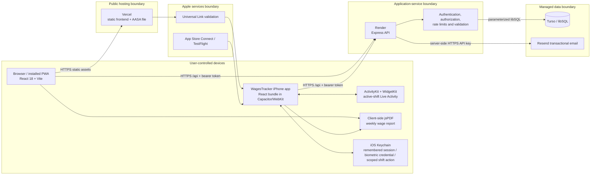
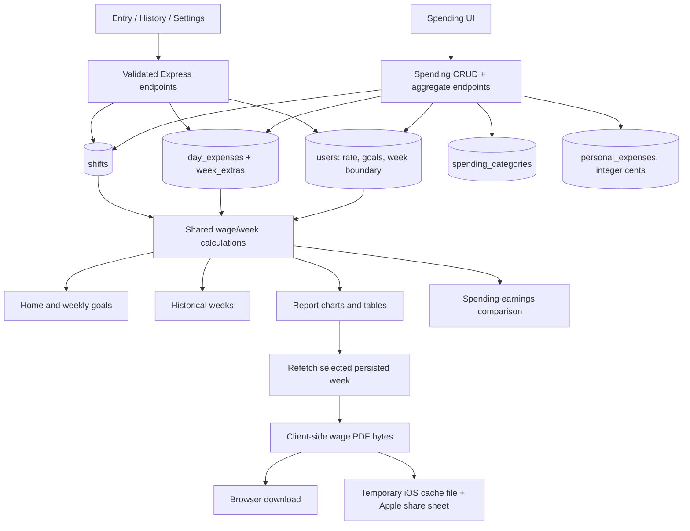
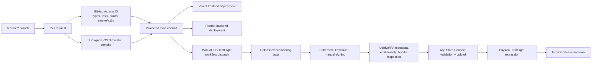

# Wage Tracker architecture

**Applies to:** 1.20.0 source candidate

**Last reviewed:** 30 August 2026

This document describes the deployed web/PWA system, the Capacitor iOS application, the security boundaries, and the delivery pipeline. Source code and automated checks remain authoritative if a diagram and implementation ever differ.

## Runtime system and trust boundaries



The browser and native web view are untrusted clients. They may provide helpful validation, but the Express API revalidates every request, derives ownership from the authenticated session, and is the only component allowed to access Turso or Resend. Vercel serves the browser/PWA assets and the public AASA file. The iOS application embeds its synchronized React build inside the signed application, so normal app startup does not load its UI from Vercel. No server credential belongs in either bundle. PDFs are generated from authenticated data on the device and are not uploaded as files to the backend.

## Authentication, sessions, biometrics, and recovery

```mermaid
sequenceDiagram
  participant C as Web / iOS client
  participant A as Express API
  participant D as Turso
  participant K as iOS Keychain
  participant E as Resend

  C->>A: Signup or login (email + password)
  A->>D: Verify Argon2id/legacy bcrypt; create session
  A-->>C: JWT containing session id + token version
  C->>K: Optional remembered or biometric-protected session (iOS only)
  C->>A: Authenticated request with bearer JWT
  A->>D: Verify JWT, token version, session state/expiry
  A-->>C: User-owned data only

  C->>A: POST /auth/forgot-password (email)
  A-->>C: Neutral response for known/unknown/malformed addresses
  A->>D: For a real account, store keyed digest of random one-use token
  A->>E: Send fragment-based reset link
  E-->>C: Email link /reset-password#token=...
  C->>A: Validate token and submit policy-valid new password
  A->>D: Atomically consume token, replace hash, increment token version, revoke every session
  A-->>C: Reset success; old password and old sessions no longer work
```

- New passwords use Argon2id. Legacy bcrypt hashes are verified only for migration and are replaced after a successful login.
- Ordinary sessions are database-backed and JWTs carry both a session id and `tokenVersion`; revocation, password change, password recovery, and account deletion invalidate them before JWT expiry.
- The iOS biometric plugin stores metadata separately from the bearer credential. The protected credential is device-only Keychain data guarded by the current biometric set and device passcode. The password itself is never stored.
- Recovery tokens are 32 random bytes. Only a domain-separated HMAC-SHA-256 digest keyed by the backend application secret is persisted. A token works once, expires after 25 minutes, and is superseded by a newer request.
- Forgot-password responses and asynchronous delivery behaviour avoid confirming whether an account exists. Per-IP and keyed per-address rate limits reduce enumeration and mail flooding.

## Wage, shift, spending, and report data flow



Shift times and plain calendar dates are the source data; hours and earnings are derived. Personal spending is deliberately separate from work/fuel inputs and from employer-facing wage PDFs. Dates are validated with the device IANA timezone and amounts use integer cents at API/persistence boundaries. Weekly extras retain an effective date so changing the user's week-start preference can re-key them without drifting their attribution.

### Active-shift lifecycle and trust boundary

An open shift remains an ordinary `shifts` row and the API remains authoritative. When a native iOS client creates or reloads an open shift, the backend issues a seven-day JWT whose audience, purpose, user and shift claims restrict it to `POST /api/shifts/:id/clock-out-action` for that exact shift. This is not a user session: it cannot read profile data, list shifts or call any other account route. The app stores it as device-only Keychain data so the system Live Activity never receives the full bearer session.

ActivityKit renders elapsed time from the shift's absolute start date, using the same overnight-start rule as `useLiveElapsedHours`; it performs no timer writes. Clock-out from the authenticated UI and from the scoped native action converge on one conditional `UPDATE ... WHERE sign_out IS NULL` transaction. Consequently, only the first accepted finish time wins, while repeated taps and background replays return the same completed row. The native action captures that time once, persists it, and submits it with an iOS-owned background upload that waits for connectivity. Failure leaves the activity in a retry state; success ends it, reports final duration and triggers a dashboard refresh when the WebView is alive.

The embedded `ShiftActivityExtension` contains presentation code and intent metadata. The `LiveActivityIntent` executes in the application process, requires device authentication and confirmation, and reaches the coordinator through the app target. See [`active-shift-live-activity.md`](active-shift-live-activity.md) for the iOS-version matrix, ActivityKit's eight-hour limit, restart boundary, separate extension signing and the Android foreground-service design that is still required.

### Work locations and allowance invariants

`work_locations` is a user-owned relational table. `GET /api/work-locations` returns active locations for selectors (with `includeArchived=true` for settings); `POST`, `PATCH`, and `DELETE` create, edit, restore, and archive only rows belonging to the authenticated user. Names are normalized per user for duplicate detection, and fuel allowances are stored as positive integer cents with a two-decimal/$10,000 boundary.

Every saved shift stores both the location ID and immutable `location_snapshot`/`fuel_allowance_snapshot_cents` values. The migration creates active rows from legacy profile fields, creates archived rows for historical-only names, and links old shifts using the same whitespace/case normalization as new writes. Editing or archiving a location therefore cannot rewrite a historical report. `GET /api/work-locations/suggestions?weekStart=YYYY-MM-DD` returns only persisted IDs from the prior week's same weekday and shift order; the client uses these only as unsaved UI defaults.

Entry presents those IDs through a responsive modal/bottom-sheet picker rather than a plain native select. The active-location list shows the address and current default allowance; an archived selection is rendered as historical context but cannot be chosen for a new shift. A suggested or selected location may preview its declared allowance, but that preview is not persisted and does not contribute to totals until a real shift with a sign-in is saved. The picker also provides a direct route to Work & pay settings for the empty or maintenance case.

`day_expenses` keeps `automatic_fuel_cents` and optional `manual_override_cents` alongside the effective `fuel_cost`. A recalculation groups worked shifts by branch and date, charges each branch at most once, and preserves the shift snapshot. `PUT /api/day-expenses/:date` is an explicit manual override/restore operation. The response includes the effective amount and source metadata (`automatic`, `manual`, `mixed`, or legacy `recorded`) so reports and PDFs can explain where an allowance came from.

## Delivery and release flow



`frontend/package.json` owns the marketing version; the lockfile, both Xcode configurations, GitHub environment, displayed app metadata, and documentation must match. `github.run_number` becomes the unique TestFlight build number. A failed signed delivery is followed by a new workflow dispatch—never **Re-run jobs**—so an already processed or out-of-order build number is not reused.

## Data entities

| Entity | Purpose | Key security/retention behaviour |
| --- | --- | --- |
| `users` | Account profile, pay settings, goals, password hash, token version | User id is taken from auth, never request ownership fields |
| `user_sessions` | Per-installation session state, expiry, revocation, biometric protection | Required by every regular-user JWT; explicit revocation supported |
| `password_reset_tokens` | Recovery-token digest and lifecycle timestamps | No raw token; one-use, expiry and invalidation columns |
| `work_locations` | User-owned named branches, optional address, allowance and archive state | Unique normalized name per user; active selector excludes archived rows |
| `shifts` | Dated start/end/location work records | Overlap, duration, future-date, ownership and timezone rules |
| `day_expenses` | Work/fuel value for a calendar day | Automatic and manual cents are retained separately; part of wage calculation; five-year pruning |
| `week_extras` | Additional weekly earnings and stable effective date | Re-keyed transactionally on week-boundary change |
| `spending_categories` | Seeded and custom personal-spending categories | Per-user active-name uniqueness; archive preserves history |
| `personal_expenses` | Optional personal spending | Integer cents, category ownership, retry idempotency and pagination |

Self-service and admin account deletion explicitly remove dependent rows before removing `users`, with database cascades as a backstop. Shift, day-expense and weekly-extra records older than five years are pruned; personal spending remains until individual or account deletion. Generated PDFs are not backend entities.

## Secret placement

| Location | Allowed sensitive values | Must never appear there |
| --- | --- | --- |
| Render environment | `JWT_SECRET`, Turso URL/token, `RESEND_API_KEY`, `MAIL_FROM`, optional `MAIL_REPLY_TO`, `ADMIN_PASSWORD` | Apple private keys/certificates unless a separate server feature needs them (none does) |
| GitHub `testflight` environment secrets | App Store Connect `.p8`, distribution `.p12` + password, application and Shift Activity App Store provisioning profiles | User passwords, database contents, runtime JWTs |
| GitHub `testflight` variables | App/extension bundle ids, marketing version, Team ID, exact profile names | Private key material |
| Vercel environment | Public `VITE_API_URL`, non-secret `APPLE_TEAM_ID` | `JWT_SECRET`, Turso token, Resend key, admin password, signing material |
| iOS source/bundle | Public API origin, bundle id, Associated Domains entitlement, compiled UI | Any server secret, password, signing private key, App Store API key |
| Local ignored `.env` / protected private storage | Development secrets and original signing files | Anything committed to Git |

Vite exposes every `VITE_` value to the browser bundle. Therefore no server credential may ever receive that prefix. Signing material is decoded only on the ephemeral macOS runner, never uploaded as an artifact, and removed by an `always()` cleanup step.

## Repository responsibilities

```text
backend/
  src/app.ts, routes/       Express composition and API endpoints
  src/security/             password, session, shift, rate-limit policy
  src/email/                provider-neutral messages and Resend transport
  src/db.ts                 schema, migrations, Turso/local libSQL boundary
  test/                     isolated HTTP/database integration tests
frontend/
  src/screens/              product and public pages
  src/settings/, admin/     settings modules and isolated admin application
  src/context/              authenticated client state and operations
  src/lib/                  API client, calculations, PDF and UI hooks
  src/platform/             web/native storage, lifecycle, deep-link and share adapters
  src/styles/               tokens and responsive component/shell styling
  scripts/                  release, iOS asset, AASA and artifact validation
ios/App/                    Xcode/Capacitor container, native plugins and ActivityKit widget extension
.github/workflows/          CI, CodeQL, Simulator and protected TestFlight delivery
render.yaml                 Render service definition
docs/                       maintained operations/architecture plus archived engineering handoffs
```

The archived handoff documents record why older fixes were made; they are not the release-status authority. This file, the README, current source, and automated release validators are the maintained references.
